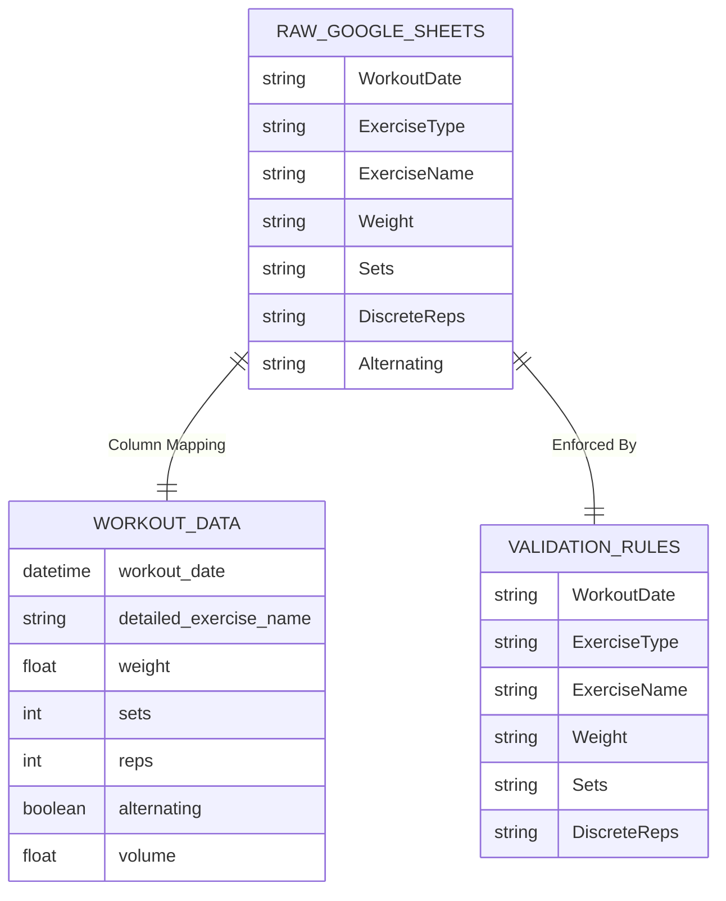
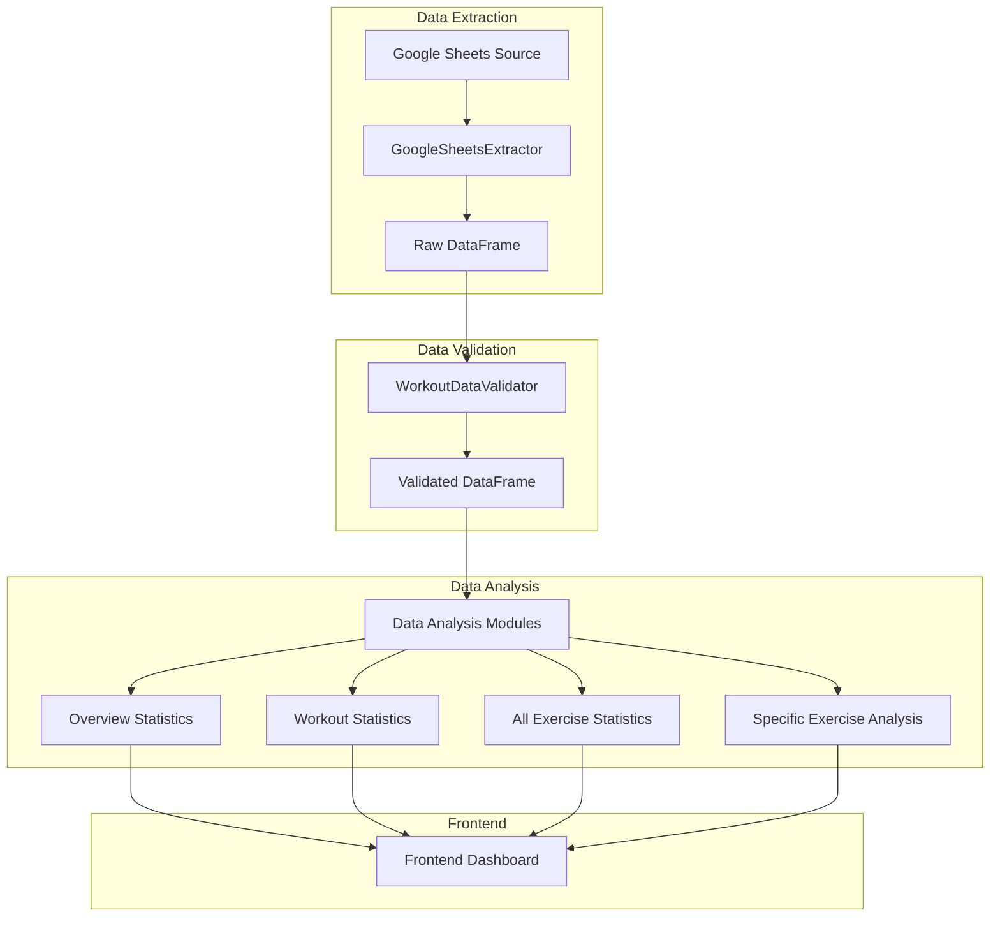
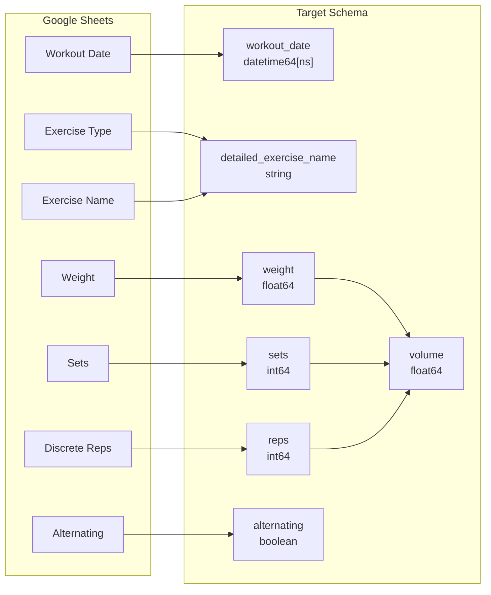
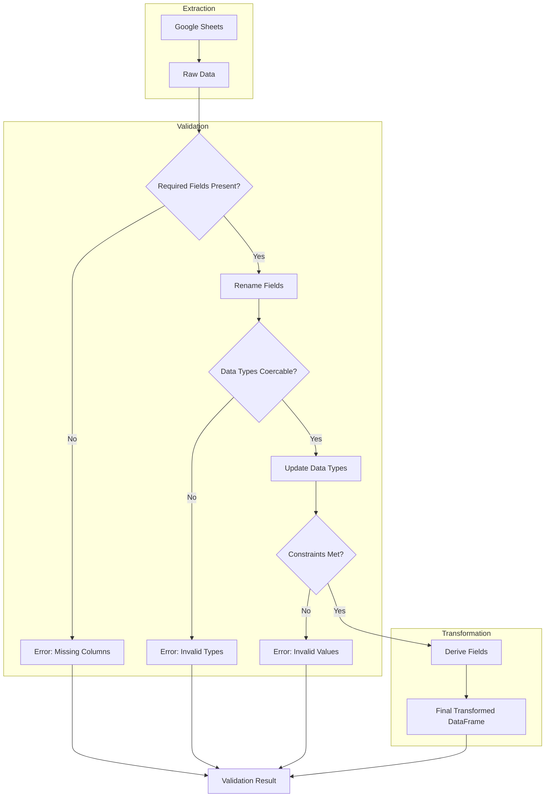
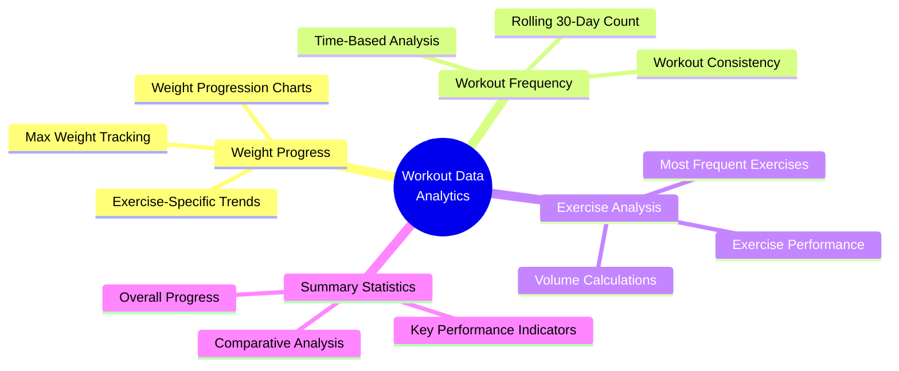
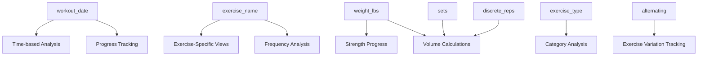

# DataFrame Structure and Data Flow

## Data Schema Overview

This document describes the dataframe structure used throughout the Exercise Mobile App project, including the data extraction, transformation, and analysis pipeline.

## DataFrame Schema Diagram

## Data Flow Pipeline

## Column Mapping and Transformation

## ETL Process

## Key Features and Analytics

## Data Relationships and Dependencies

